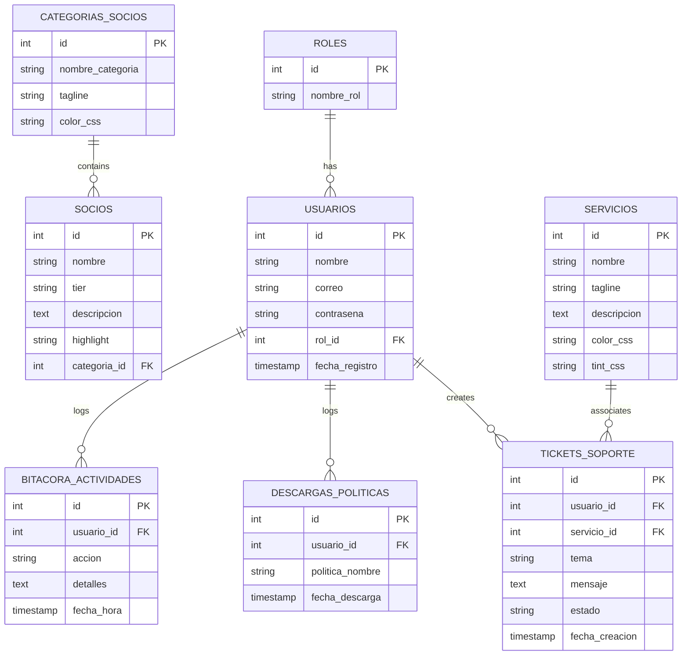

# Requerimientos de Base de Datos y Modelo Relacional (Avance II)

Este documento detalla la estructura, normalización y requerimientos técnicos del sistema de base de datos MySQL y la arquitectura cliente/servidor del sitio web **MGN Technology**.

---

## 1. Diseño del Modelo Relacional (8 Tablas)

El diseño de la base de datos consta de exactamente **8 tablas**, las cuales se comunican para mantener consistencia, integridad y auditoría de transacciones. El script de creación e inserción de datos iniciales se encuentra en [db/schema.sql](file:///Users/ranmsy/Documents/GitHub/fidelitas/SC-502-Ambiente-Web-Cliente-Servidor/proyecto-final/db/schema.sql).



### Detalle de las Tablas

1. **`roles`**: Contiene la definición de los perfiles de acceso.
   * *Campos:* `id` (PK), `nombre_rol` (Unique).
2. **`usuarios`**: Registra los datos de acceso del personal y clientes de la organización.
   * *Campos:* `id` (PK), `nombre`, `correo` (Unique), `contrasena` (Bcrypt Hash), `rol_id` (FK), `fecha_registro`.
3. **`categorias_socios`**: Agrupa a las marcas en sus respectivas líneas técnicas.
   * *Campos:* `id` (PK), `nombre_categoria` (Unique), `tagline`, `color_css`.
4. **`socios`**: Los partners oficiales de MGN (Fortinet, Microsoft, Cisco, etc.).
   * *Campos:* `id` (PK), `nombre` (Unique), `tier`, `descripcion`, `highlight`, `categoria_id` (FK).
5. **`servicios`**: Las seis principales soluciones técnicas ofrecidas por la empresa.
   * *Campos:* `id` (PK), `nombre` (Unique), `tagline`, `descripcion`, `color_css`, `tint_css`.
6. **`tickets_soporte` (Transaccional)**: Tabla nuclear de transacciones. Permite a los clientes enviar consultas técnicas y al equipo de soporte gestionar sus estados operativos.
   * *Campos:* `id` (PK), `usuario_id` (FK), `servicio_id` (FK, Nullable), `tema`, `mensaje`, `estado` (Abierto, En Progreso, Resuelto), `fecha_creacion`.
7. **`descargas_politicas` (Transaccional / Auditoría)**: Registra la transacción de descarga de políticas de la empresa (Protección Ambiental, Anticorrupción, Prácticas Laborales), asociándolo al ID del usuario logueado o NULL si es un invitado.
   * *Campos:* `id` (PK), `usuario_id` (FK, Nullable), `politica_nombre`, `fecha_descarga`.
8. **`bitacora_actividades` (Transaccional / Auditoría)**: Bitácora general para auditar eventos críticos del sistema en tiempo real.
   * *Campos:* `id` (PK), `usuario_id` (FK, Nullable), `accion`, `detalles`, `fecha_hora`.

---

## 2. Análisis de Normalización (Tercera Forma Normal - 3NF)

El diseño de la base de datos se ha normalizado estrictamente hasta la **Tercera Forma Normal (3NF)** para evitar redundancias de datos y anomalías de actualización:

1. **Primera Forma Normal (1NF)**:
   * Todos los atributos contienen valores atómicos (por ejemplo, el nombre, correo y contraseñas no se agrupan en un solo string compuesto).
   * No existen grupos repetitivos ni arrays dentro de columnas.
   * Cada tabla posee una clave primaria (`id`) única.
2. **Segunda Forma Normal (2NF)**:
   * Cumple con la 1NF.
   * No existen dependencias parciales. Dado que todas las tablas tienen claves primarias simples de una sola columna (`id`), todos los atributos no clave dependen funcional y completamente de toda la clave primaria.
3. **Tercera Forma Normal (3NF)**:
   * Cumple con la 2NF.
   * No existen dependencias transitivas. Cualquier atributo no clave depende únicamente de la clave primaria. Por ejemplo:
     * En lugar de almacenar el nombre del rol del usuario directamente en la tabla `usuarios` (lo cual crearía una dependencia transitiva `usuario_id -> rol_id -> nombre_rol`), se aísla el nombre del rol en la tabla `roles` y se referencia únicamente por su ID (`rol_id`).
     * De la misma manera, las categorías de socios se aíslan en `categorias_socios` para evitar que las descripciones o taglines dependan de la clave primaria de `socios`.

---

## 3. Control de Acceso Basado en Roles (RBAC)

El servidor Express valida las firmas de los tokens JWT y expone permisos específicos según el rol del usuario:

* **Cliente (Client)**:
  * Puede ver y registrar sus propios tickets de soporte en la base de datos.
  * Al descargar políticas éticas en la página Valores, se asocia su ID al registro de auditoría.
* **Soporte (Support)**:
  * Tiene acceso a todos los tickets de soporte enviados por cualquier cliente.
  * Puede realizar transacciones de actualización de estados (`Abierto` -> `En Progreso` -> `Resuelto`).
  * Puede consultar la bitácora de descargas de políticas corporativas.
* **Administrador (Admin)**:
  * Posee acceso de lectura completo de la bitácora general de actividades del sistema (`bitacora_actividades`), visualizando los logs de autenticación y gestiones técnicas.

---

## 4. Instrucciones para la Ejecución Local

### Prerrequisitos
1. **MySQL Server:** Tener una instancia local o remota corriendo.
2. **Node.js y Yarn:** Instalados en el sistema del docente.

### Paso 1: Importar la Base de Datos
Ejecute el script SQL para crear la base de datos `mgn_db` y cargar los datos de semilla:
```bash
mysql -u root -p < db/schema.sql
```

### Paso 2: Configurar y Correr el Servidor Backend
1. Navegue al directorio del servidor:
   ```bash
   cd proyecto-final/server
   ```
2. Configure las variables de conexión en el archivo [server/.env](file:///Users/ranmsy/Documents/GitHub/fidelitas/SC-502-Ambiente-Web-Cliente-Servidor/proyecto-final/server/.env) (ajuste `DB_PASSWORD` y `DB_USER` según su entorno local de MySQL).
3. Inicie el servidor:
   ```bash
   yarn start
   ```
   El servidor de API correrá en `http://localhost:3000`.

### Paso 3: Correr el Cliente Angular
1. Abra otra terminal en la raíz del proyecto Angular:
   ```bash
   cd proyecto-final
   ```
2. Inicie el servidor de desarrollo:
   ```bash
   yarn start
   ```
   Abra la aplicación en su navegador en `http://localhost:4200`.

### Credenciales de Semilla para Pruebas:

